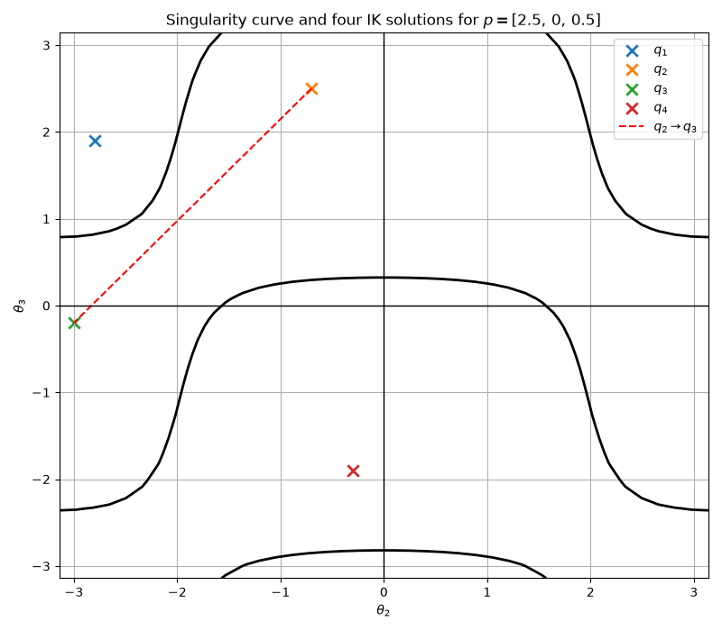

# Redundent Cuspidal Robots
A cuspidal robot means its IK solutions can be transfered without crossing a singularity surface, which provides the challenges for path planning as there might not be a repeatable continuous path in configuration space existing.

This figure shows that there are four IK solutions for the same target poses where $q_2$ and $q_3$ can transfer to each other without crossing the singularity surface.