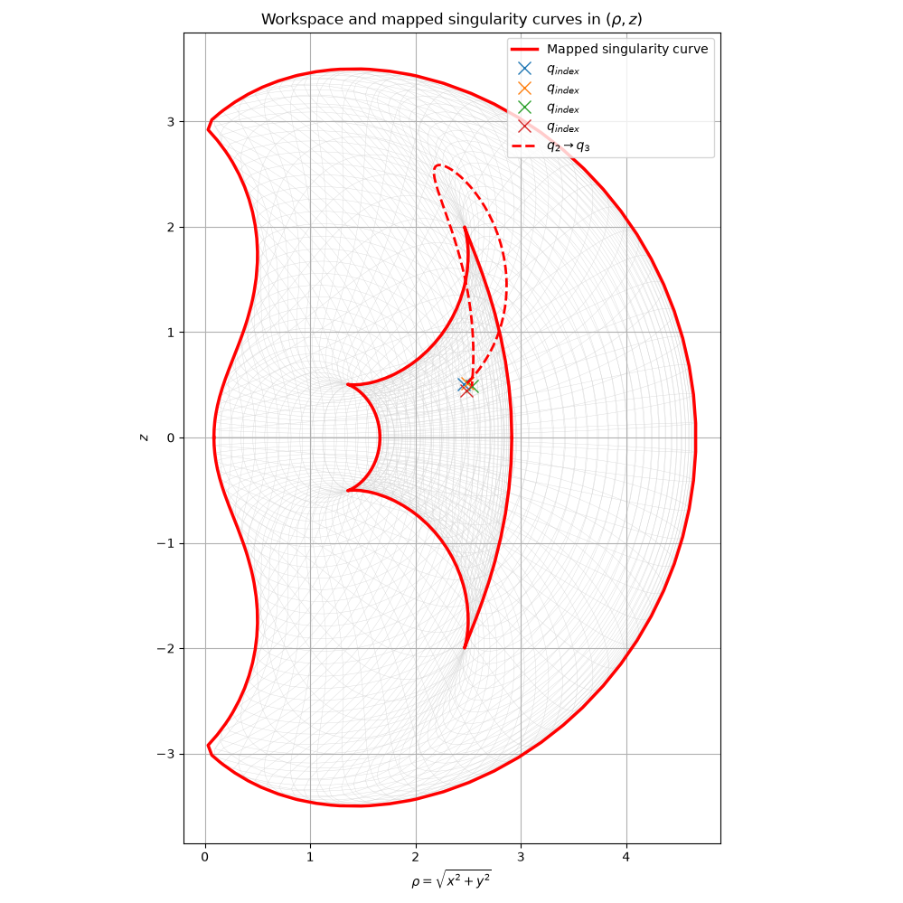

# Redundent Cuspidal Robots

## Cuspidal Robot
A cuspidal robot means its IK solutions can be transfered without crossing a singularity surface, which provides the challenges for path planning as there might not be a repeatable continuous path in configuration space existing.

This figure shows that there are four IK solutions for the same target poses where $q_2$ and $q_3$ can transfer to each other without crossing the singularity surface.

This figure shows that workspace of this cuspidal 3R robot where real line is the boundaries. The outter boundary is the maximum workspace boundaries. The inner boundary is the due to the inner singularity. The red dashed line is the workspace path when $q_2$ transfers to $q_3$ as a straight line.